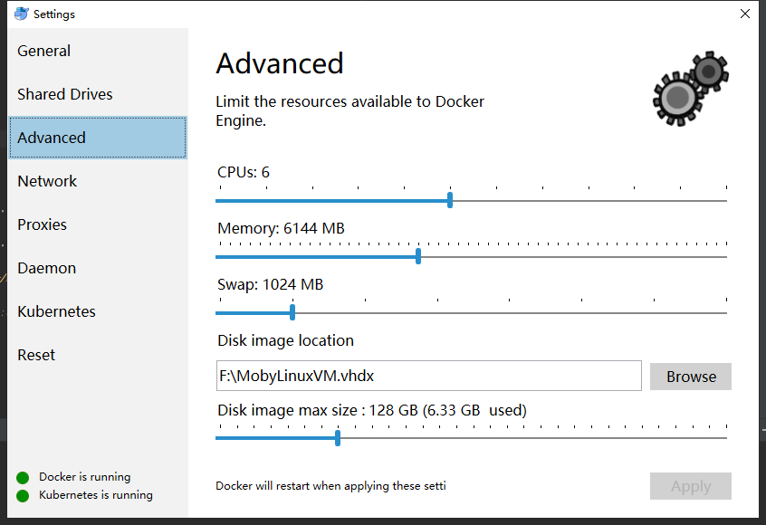
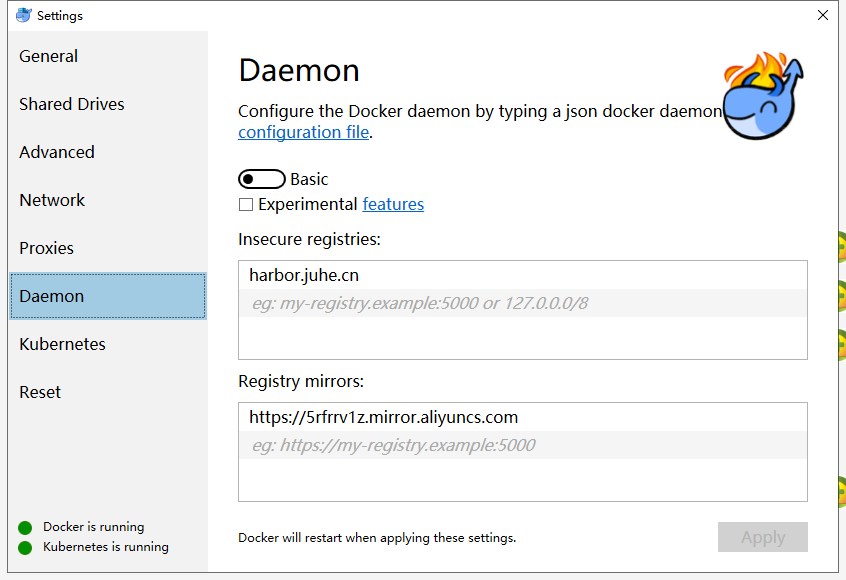
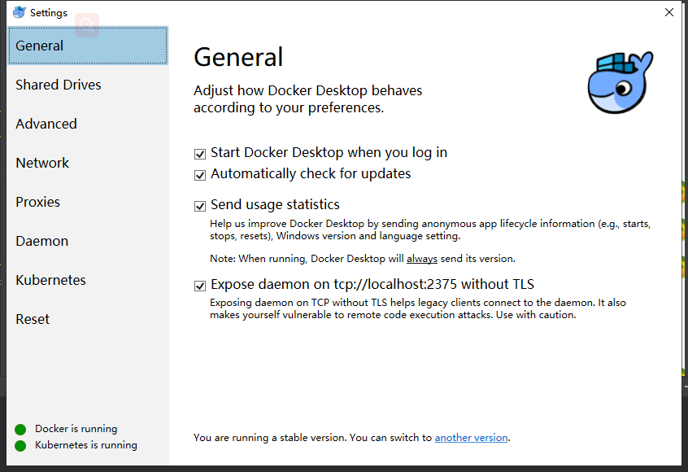

# docker下的redis环境搭建

## 下载
> Windows环境

- 下载Docker for Windows ：https://hub.docker.com/?overlay=onboarding

### 搭建步骤

> Windows环境部署
- 注册账号：https://hub.docker.com/signup;
- 双击安装Docker for Windows Installer.exe;
- 设置setting->advanced

- 设置setting->Daemon

- 设置setting->General

